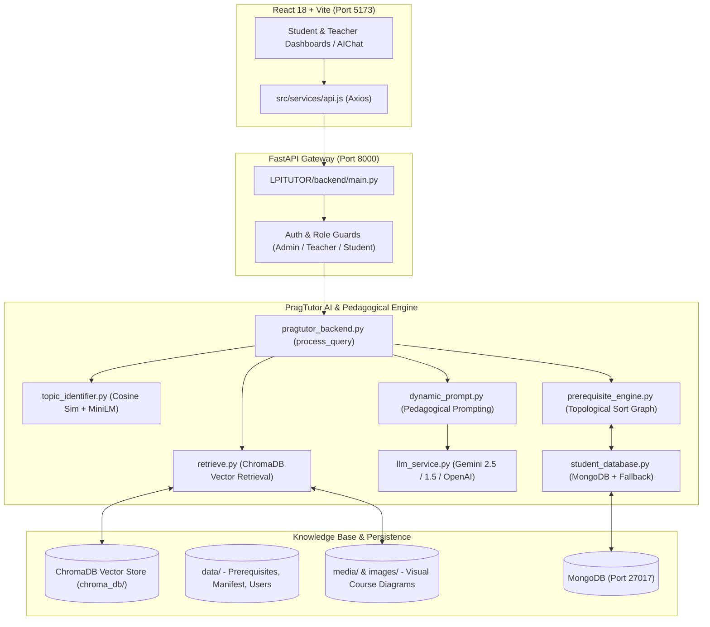

# PragTutor (LPI-Tutor)
## Personalized Pragmatic Intelligent Tutoring System with Multimodal RAG & Knowledge Graphs

PragTutor is an intelligent tutoring system designed to guide students systematically through computer science topics. It combines vector-based Retrieval-Augmented Generation (ChromaDB + Sentence Transformers), topic prerequisite dependency graphs, student mastery tracking, and multimodal visual document grounding to deliver pedagogically sound explanations.

---

## 🏛️ System Architecture



---

## 📂 Project Organization & Directory Map

```text
reddy_tutor/
├── start.py                   # Master entry point (orchestrates backend + frontend)
├── pragtutor_backend.py       # Core orchestrator pipeline (process_query)
├── topic_identifier.py        # Semantic topic identification via cosine similarity
├── prerequisite_engine.py     # DAG prerequisite traversal & learning path generator
├── retrieve.py                # ChromaDB vector retrieval + multimodal visual search
├── dynamic_prompt.py          # Pedagogical prompt builder & multimodal payload assembly
├── llm_service.py             # LLM provider gateway (Google Gemini & OpenAI)
├── student_database.py        # Student profile, mastery tracking & MongoDB adapter
├── build_knowledge_base.py    # PDF chunker, embedder, and ChromaDB collection builder
├── visual_processor.py        # Extracts diagrams/figures from course PDFs to media/
├── multimodal_processor.py    # Encodes base64 images and extracts OCR context
│
├── LPITUTOR/                  # Web Application
│   ├── backend/
│   │   └── main.py            # FastAPI REST & Upload API Server (Port 8000)
│   ├── src/
│   │   ├── pages/             # Student, Teacher, Admin, and Chat dashboards
│   │   ├── components/        # UI components (Navbar, Sidebar, MermaidDiagram)
│   │   ├── services/api.js    # Centralized frontend API client
│   │   └── context/           # Authentication state context
│   └── package.json           # Frontend dependencies & Vite scripts
│
├── data/                      # Course metadata and persistence
│   ├── os_1.pdf - os_5.pdf    # Active textbook/course materials for Operating Systems
│   ├── prerequisites_operating_systems.json # Prerequisite dependency graph
│   ├── visual_metadata_operating_systems.json # Extracted diagrams metadata
│   ├── pdf_manifest.json      # Teacher PDF upload registry
│   ├── subjects.json          # Subject catalog
│   ├── kb_status.json         # Knowledge base preparation status
│   └── users.json             # Persistent local backup of users
│
├── media/                     # Extracted PDF figures served via /media/
├── sample_pdfs/               # Reference course PDFs for knowledge base setup
└── chroma_db/                 # Persistent vector store embeddings (all-MiniLM-L6-v2)
```

---

## 🚀 How to Run the Project

### Prerequisites
- Python 3.10+ with active `venv`
- Node.js 18+ and `npm`
- (Optional) MongoDB running on `localhost:27017` (System automatically uses in-memory fallback if MongoDB is not running)

### One-Command Start
Run the unified orchestrator script from the root directory:
```bash
python3 start.py
```
This automatically boots:
1. **Python AI Backend Server** on `http://localhost:8000`
2. **React EdTech Frontend** on `http://localhost:5173`

To stop all services simultaneously, press `Ctrl+C`.

---

## 🧠 Key Workflows for Academic Review

### 1. Topic Identification
- **File**: `topic_identifier.py`
- **Method**: Converts student query to embeddings using `all-MiniLM-L6-v2` and calculates cosine similarity against course topics.

### 2. Prerequisite & Learning Path Engine
- **File**: `prerequisite_engine.py`
- **Method**: Models topics as a Directed Acyclic Graph (DAG). Compares required prerequisites with `student_database.py` (completed topics) to identify learning gaps and compute a topologically ordered prerequisite sequence.

### 3. Vector Retrieval & Grounding (RAG)
- **File**: `retrieve.py`
- **Method**: Queries ChromaDB for top-K text chunks relevant to the query and matches relevant diagram figures extracted by `visual_processor.py`.

### 4. Dynamic Prompt Construction
- **File**: `dynamic_prompt.py`
- **Method**: Dynamically synthesizes the student's mastery level, learning gap status, and retrieved textbook passages into a structured prompt instructing the LLM to teach conceptually.

### 5. Multi-Provider LLM Generation
- **File**: `llm_service.py`
- **Method**: Communicates with Google Gemini (or OpenAI) using REST API calls with SSL verification and error handling.
